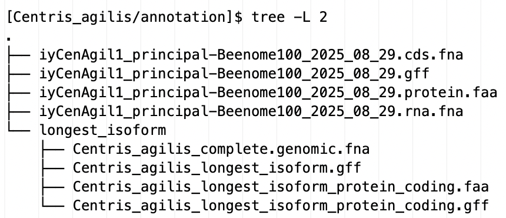

# EGAPx annotation protocol
Structural annotation of Beenome100 genome assemblies using [EGAPx](https://github.com/ncbi/egapx).

## Contents
- [Prerequisites](#prerequisites)
- [Input Evidence](#input-evidence)
  * [RNAseq](#rnaseq)
  * [Protein evidence](#protein-evidence)
- [Run EGAPx](#run-egapx)
  * [Input files](#input-files)
    + [YAML config file](#yaml-config-file)
    + [RNAseq list file](#rnaseq-list-file)
  * [EGAPx](#egapx)
    + [QC scripts (optional)](#qc-scripts--optional-)
- [Processing EGAPx output](#processing-egapx-output)
  * [GenBank/RefSeq assemblies](#genbank-refseq-assemblies)
  * [Embargoed assemblies](#embargoed-assemblies)
- [Non-bee assemblies](#non-bee-assemblies)

## Prerequisites 
EGAPx v0.4.0-alpha

## Input Evidence
### RNAseq
Beenome RNAseq files (head, thorax, abdomen, whole) are on Juno and the beenome_collab directory on Ceres. Overall, the reads show high quality and minimal adaptor contamination, so read processing is skipped.

For each species, map the RNAseq using the [STAR](https://github.com/alexdobin/STAR) aligner with default settings. Look for at least 10 million mapped reads. 

Check [SRA](https://www.ncbi.nlm.nih.gov/sra?db=sra) for conspecific RNAseq. If other tissues are available, include them as long as they are not from experimental treatments and have at least 10 million mapped reads. 

If conspecific RNAseq is not available for head, abdomen, or thorax, use congeneric Beenome RNAseq instead. If conspecific and congeneric data are available, do not add confamilial data even if that means tissues remain missing. Use confamilial RNAseq as a last resort, when neither conspecific nor congeneric data are available. When selecting confamilial data, use [Michael’s phylogeny](other/beenome-ncbi-combined-1167t-95p.phylip.tre.pdf) to identify a closer relative.

When using congeneric or confamilial RNAseq, verify that at least 10 million reads map to the source species (the species the RNAseq library came from) but it is not necessary to check whether 10 million reads also map to the target species (the species being annotated). Non-conspecific reads use [modified EGAPx alignment parameters](https://github.com/ncbi/egapx?tab=readme-ov-file#modifying-default-parameters). 

### Protein evidence
The protein evidence provided by NCBI is supplemented with manually curated protein sequences provided by the Beenome working groups. Add the custom files [7399_v0.4.0_with_manual_annotations.faa](custom_protein_evidence/7399_v0.4.0_with_manual_annotations.faa) and [7399_v0.4.0.trusted_proteins.gi](custom_protein_evidence/7399_v0.4.0.trusted_proteins.gi) to the EGAPx parameter file.

If this [error](https://github.com/ncbi/egapx/issues/99) occurs (rare):
```
ERROR ~ Error executing process > 'egapx:target_proteins_plane:miniprot:run_miniprot (5)'
Caused by:
  Process `egapx:target_proteins_plane:miniprot:run_miniprot (5)` terminated with an error exit status (134)
...
[morecore] insufficient memory
```
Use [7399_v0.4.0_with_manual_annotations_no_NP_001189070.1.faa](custom_protein_evidence/7399_v0.4.0_with_manual_annotations_no_NP_001189070.1.faa) instead of 7399_v0.4.0_with_manual_annotations.faa.

## Run EGAPx
### Input files
#### YAML config file
```
genome: 
taxid: 
locus_tag_prefix:
short_reads: 
proteins: 7399_v0.4.0_with_manual_annotations.faa
proteins_trusted: 7399_v0.4.0.trusted_proteins.gi
```
**genome**: If the assembly has RefSeq annotations, use the same assembly version that was used for the RefSeq annotations (this facilitates comparisons between annotation datasets).

**taxid**: Get from [NCBI](https://www.ncbi.nlm.nih.gov/taxonomy). EGAPX uses the TaxID to determine which evidence to use; if the exact species is unavailable, use a TaxID from the same genus. 

**locus tag prefix**: Each genome assembly has a locus tag prefix (e.g., ACXWH3) that is passed to all annotations from that assembly. This handle links each annotation to its specific assembly. This is helpful because EGAPx uses numeric annotation names. Without the prefix, the same numeric IDs across multiple annotation datasets are easy to confuse. 

Sometimes the LTP can be found on the NCBI submission portal. If not, request the LTP from NCBI (provide the BioProject and BioSample IDs).

**short_reads**: Path to the RNAseq file list (see below).

If congeneric or confamilial RNAseq is present, use the following YAML file:
```
genome: 
taxid:
locus_tag_prefix:
short_reads: 
proteins: 7399_v0.4.0_with_manual_annotations.faa
proteins_trusted: 7399_v0.4.0.trusted_proteins.gi
tasks:
  rnaseq_collapse:
    rnaseq_collapse: -high-identity 0.8
  convert_from_bam:
    sam2asn: -filter 'pct_identity_gap >= 85'
  star_wnode:
    star_wnode: -pct-identity 85
```

#### RNAseq list file
```
abdomen /path/to/R1
abdomen /path/to/R2
head /path/to/R1
head /path/to/R2
thorax /path/to/R1
thorax /path/to/R2
```
Although EGAPx supports listing the RNAseq files in the config file, a [bug](https://github.com/ncbi/egapx/issues/118) in v0.4.0 requires the RNAseq entries to be provided in a separate file instead.

### EGAPx
On Ceres:
```
NAME=<genus>_<species>

module load egapx/0.4.0-alpha

egapx.py --output "${NAME}_EGAPx" --executor slurm "egapx_${NAME}.yaml"

cd "${NAME}_EGAPx"

for FILE in *; do mv "${FILE}" "${NAME}_${FILE}"; done

```
For consistency with the Beenome annotations, use EGAPx **v0.4.0-alpha**.

#### QC scripts (optional)
[unfinished section] In addition to BUSCO analyses (which EGAPx performs), it can be useful to align the annotated proteome against *Drosophila melanogaster* and compare the distribution of protein similarities against similar species

This is a metric NCBI uses for RefSeq annotations (for example [here](https://www.ncbi.nlm.nih.gov/refseq/annotation_euk/Hylaeus_volcanicus/GCF_026283585.1-RS_2023_03/))

A simplified version is available here using reference data from RefSeq annotated bees; it's been useful as a comparative assessment

add conda environment file
<details>
<summary>EGAPx with QC</summary>
<br>

```
NAME=<genus>_<species>

egapx.py --output "${NAME}_EGAPx" --executor slurm "egapx_${NAME}.yaml"

cd "${NAME}_EGAPx"

for FILE in *; do mv "${FILE}" "${NAME}_${FILE}"; done

mkdir QC
cd QC
cp /project/beenome100/kim.vertacnik/EGAPx/QC_params.yml .
sed -i "s/empty/"${NAME}"/g" QC_params.yml
ln -s /project/beenome100/kim.vertacnik/programs/QC/tools tools
ln -s /project/beenome100/kim.vertacnik/EGAPx/QC.cwl QC.cwl
ln -s /project/beenome100/kim.vertacnik/EGAPx/QC.sh QC.sh
sbatch QC.sh

```
</details>


## Processing EGAPx output
Once EGAPx has successfully finished, delete the NextFlow "work" directory because it is typically over 100GB.

### GenBank/RefSeq assemblies
1. Get the following annotation files from the EGAPx output directory:
```
complete.cds.fna
complete.genomic.gff
complete.proteins.faa
complete.transcripts.fna
```
Rename the files using the following structure:
```
<ToLiD>_principal-Beenome100_<analysis year>_<analysis month>_<analysis day>.cds.fna
<ToLiD>_principal-Beenome100_<analysis year>_<analysis month>_<analysis day>.gff
<ToLiD>_principal-Beenome100_<analysis year>_<analysis month>_<analysis day>.protein.faa
<ToLiD>_principal-Beenome100_<analysis year>_<analysis month>_<analysis day>.rna.fna
````

`ToLiD` (Tree of Life identifier) is a unique name for species and related specimens. Each Beenome assembly has a ToLiD. See [here](https://id.tol.sanger.ac.uk/).

2. To facilitate scripting, convert the FASTA files from interleaved to single-line. 
<details>
<summary>Example using fasta_formatter (from FASTX-Toolkit)</summary>
<br>

```
for item in *a; do fasta_formatter -w 0 -i ${item} -o ${item}_1line; mv ${item}_1line ${item}; done
```

</details>
<br>

Sanity check:`grep -c ">"` on the protein file should yield ~20,000 matches.

3. Get the longest protein isoform for each gene. 

Use [longest_isoform.sh](longest_isoform/longest_isoform.sh).

<details>
<summary>Explanation of script</summary>
<br>

`agat_sp_filter_feature_by_attribute_value.pl` is run twice because running 
`--type gene --attribute gene_biotype --value protein_coding`
still includes pseudogenes even though "protein_coding" is explicitly specified. The second run removes the pseduogenes.

Also, the first filter command has a "!" not flag because in the `agat_sp_filter_feature_by_attribute_value.pl` description, "If the attribute exists and the value pass the test, the feature is discarded", not retained.

</details>
<br>

The script uses [AGAT](https://github.com/NBISweden/AGAT) and [FASTX-Toolkit](http://hannonlab.cshl.edu/fastx_toolkit/). For convenience, a [conda environment file](longest_isoform/longest_isoform_conda_environment.yml) is available.

To install the conda environment run `conda env create -f longest_isoform_conda_environment.yml` which will create an environment named `agat_env`.

For `longest_isoform.sh`, provide both the GFF file (`complete.genomic.gff`) and the EGAPx genome FASTA (`complete.genomic.fna`), both found in the EGAPx output directory. The sequence content is the same as in the input assembly, but the formatting differs: the EGAPx FASTA is interleaved (which AGAT prefers), whereas Beenome assembly FASTA files are single-line. See [here](https://github.com/ncbi/egapx/issues/100) for details.

`longest_isoform.sh` produces three files:
```
longest_isoform.gff
longest_isoform_protein_coding.faa
longest_isoform_protein_coding.gff
```

Sanity check:
* `grep -c ">"` on the protein file should yield ~10,000 matches.
* `grep -c "gene_biotype=protein_coding"` on the gff file should match the output of `grep -c ">"`.

4. Upload to beenome_collab (if not already here)

Find the species annotation folder and organize the files with the following structure. For scripting purposes, do not deviate from this structure. 




5. Check file group and permissions
The files should have owner and group read permissions only (`-r--r-----`) and belong to the group `proj-beenome100_collab`

`-r--r-----. 1 user.name proj-beenome100_collab  42M Feb 22 15:33 annotation.file`

The longest_isoform directory should have the permissions `drwxr-s---` (if chmod 440 is accidentally run on the directory it becomes inaccessible)

`drwxr-s---. 2 user.name proj-beenome100_collab 4.0K Feb 22 15:42 longest_isoform`


### Embargoed assemblies
[unfinished section] Will need to use annotation files extracted from the `prepare_submission` .sqn file ()

## Non-bee assemblies
Do not use the custom protein files and do not include the `proteins:` and `proteins_trusted:` lines in the EGAPx YAML file.

If the annotations will be submitted to NCBI, use the official locus tag prefix from NCBI. If the data will only be used internally, improvise a locus tag prefix using the first three names of the genus and species name, e.g., *Tribolium castaneum* would be TRICAS.

Regarding the ToLiDs used in file naming, if the assembly does not have a unique ToLID use the assembly name, e.g., Tcas5.2.

